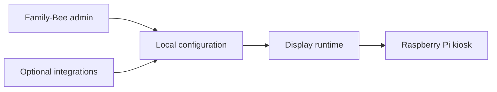

# Family-Bee

An open-source, local-first family display for Raspberry Pi.

Family-Bee is designed to turn an old TV, monitor or tablet into a calm shared household display. This repository currently contains the first screen-design slice: a feature-list and live-preview experience for configuring what appears on the wall.

## Current design slice

- Feature catalogue for calendars, photos, weather, tasks, meals, smart home, travel, news and notes.
- On/off feature toggles with active-count and progress feedback.
- Search, category filters and sorting.
- Live 16:9 display preview designed for a Raspberry Pi kiosk.
- Google connection centre with multiple-account support, Calendar and Tasks source selection.
- Local-first shopping list concept with optional Google Tasks mirroring.
- Responsive administration view for laptop, tablet and mobile.
- No build step or runtime dependency: plain HTML, CSS and JavaScript.

## Run locally

Requires Python 3, which is available on Raspberry Pi OS:

```bash
git clone https://github.com/Wattysaid/Family-Bee.git
cd Family-Bee
python3 -m http.server 8080
```

Open `http://localhost:8080` in a browser. For a wall display, use Chromium kiosk mode:

```bash
chromium-browser --kiosk --noerrdialogs --disable-infobars http://localhost:8080
```

The same project can also be started with `npm start`.

## Google integrations

The connection screen is ready for Google Identity Services. Copy `config.example.js` to `config.js`, add a Web application OAuth client ID and follow [the integration guide](docs/GOOGLE-INTEGRATIONS.md). The demo account remains available when no OAuth configuration is present.

Family-Bee treats shopping lists as local-first because the supported Google Workspace APIs provide Calendar and Tasks, rather than a public consumer shopping-list API. A dedicated Google Tasks list can be used as an optional mirror.

## Direction

The long-term architecture is intentionally lightweight and Raspberry Pi-friendly:



Local data and predictable rendering should remain the default. Online services should be optional adapters rather than hard dependencies.

## Roadmap

1. Extract the display runtime from the design prototype.
2. Add a local JSON/SQLite configuration service.
3. Add calendar and weather adapters with graceful offline states.
4. Add family profiles, chores and touch-friendly completion flows.
5. Add a setup wizard and Raspberry Pi autostart image.
6. Add a pluggable integration system for Home Assistant, iCloud, Google Calendar and RSS.

## Licence

MIT. See [LICENSE](LICENSE).

## Inspiration and scope

Family-Bee is an independent open-source project inspired by the general category of digital family displays. It does not use DAKboard branding, code or proprietary assets.

